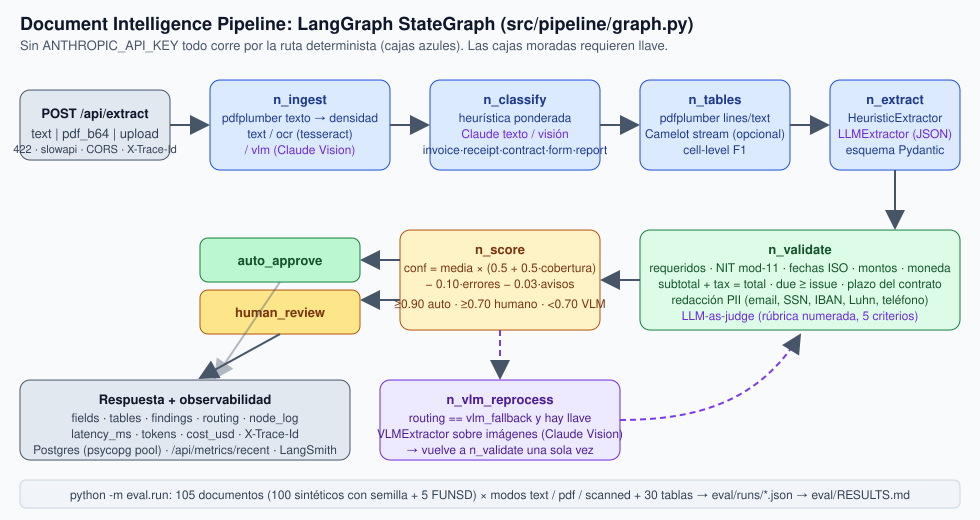

# Arquitectura



## Resumen

Un documento entra como texto, PDF en base64 o archivo subido. El API lo
valida y lo entrega a un `StateGraph` de LangGraph que decide la ruta de
parsing, clasifica, extrae tablas y campos, valida, puntúa y, si la confianza
es baja y hay llave, reprocesa con Claude Vision. La respuesta incluye el
JSON extraído, hallazgos de validación, la decisión de enrutamiento y la
telemetría de la petición.

## Capas y dependencias

```
src/
├── config.py            # Settings (pydantic-settings); única lectura del entorno
├── schemas/             # dominio: ExtractedField, Finding, ParsedDocument, PipelineResult,
│                        #          esquemas por tipo (InvoiceSchema, ...), REQUIRED/CRITICAL_FIELDS
├── llm/client.py        # ClaudeClient: SDK anthropic + timeout + tenacity + costo por llamada
├── parsers/             # text (pdfplumber), ocr (pypdfium2 + tesseract), vlm (Claude Vision),
│                        # layout (partición en elementos), router (text|ocr|vlm)
├── classifier/          # heurística ponderada, Claude texto, Claude Vision
├── tables/              # pdfplumber (lines/text), Camelot stream opcional
├── extractors/          # HeuristicExtractor (reglas), LLMExtractor, VLMExtractor, normalize
├── validators/          # regex_rules (NIT mod-11, fechas, montos), cross_field, pii, llm_judge
├── scoring/             # confianza de documento y routing
├── pipeline/graph.py    # LangGraph: nodos n_* y arista condicional de reprocesamiento
├── storage/             # Repository Protocol: PostgresRepository (psycopg_pool) | NullRepository
├── observability/       # trace_id, spans por nodo, costo, RecentRequests, LangSmith por env
├── synth/               # generador sintético, PDFs reportlab, conversión FUNSD
├── eval/                # dataset, métricas, pipelines comparados, reporte
└── api/                 # FastAPI: schemas HTTP, 422, slowapi, CORS, X-Trace-Id, métricas
```

Reglas de dependencia (verificadas por los imports):

- `schemas/` no importa nada del proyecto salvo a sí mismo.
- Los componentes de dominio (`parsers`, `classifier`, `extractors`,
  `validators`, `scoring`, `tables`) importan `schemas`, `llm` y `config`;
  nunca `api` ni `storage`.
- `pipeline/` compone los componentes; `api/` solo conoce `pipeline`,
  `storage`, `observability` y sus propios schemas HTTP.
- `eval/` y `synth/` usan el pipeline como caja negra y no son importados por
  el API.

## Flujo por nodo

| Nodo | Entrada | Salida | Notas |
|---|---|---|---|
| `n_ingest` | `pdf_bytes` o `text`, `force_vlm` | `parsed`, `images`, `pipeline_used` | Con PDF: pdfplumber primero; si la densidad media es < `OCR_MIN_CHARS_PER_PAGE` la página se considera escaneada. Ruta `ocr` si hay tesseract; `vlm` si no hay OCR pero sí llave; `text` en el resto. Las imágenes se rasterizan (150 dpi) solo cuando hacen falta. |
| `n_classify` | `parsed`, `requested_type` | `doc_type`, `classifier_method` | Tipo pedido por el cliente → `requested`. Con texto: heurística ponderada (o Claude). Sin texto: Claude Vision sobre la primera imagen. Salida no parseable del modelo → heurística con confianza ≤ 0.6 y aviso en el log. |
| `n_tables` | `pdf_bytes`, `parsed.has_tables` | `tables` | pdfplumber con estrategia `lines` (confianza 0.9) y luego `text` (0.7); Camelot `stream` si está instalado y pdfplumber no encontró nada. |
| `n_extract` | `parsed.text`, `doc_type` | `fields`, `extractor_method` | Sin llave o salida inválida: `HeuristicExtractor`. Con llave: `LLMExtractor` valida el JSON del modelo contra el esquema del tipo (nombres permitidos, montos, fechas). |
| `n_validate` | `fields`, `doc_type`, `parsed` | `findings`, `fields` | Requeridos, formato, NIT, aritmética, fechas, plazo; penaliza 0.3 a los campos con error; redacción de PII si `REDACT_PII`. |
| `n_score` | `fields`, `findings` | `confidence`, `routing` | Ver fórmula en `src/scoring/confidence.py`. |
| `n_vlm_reprocess` | `images`, `doc_type` | `fields`, `vlm_reprocessed` | Solo una vez por documento; un fallo de parseo deja los campos anteriores y registra el motivo. |

Los nombres de nodo llevan el prefijo `n_` para que nunca coincidan con una
clave del estado (`fields`, `tables`, …), que es el error que rompía otros
grafos del portafolio.

## Tres tipos de entrada

| Entrada | Ruta | Cómo se prueba |
|---|---|---|
| PDF con capa de texto | `text` | `tests/test_pipeline.py::test_pdf_path_extracts_tables` con PDF de reportlab |
| PDF escaneado | `ocr` | `render_scanned_pdf` rasteriza un PDF y lo reincrusta como imagen; `test_scanned_path_uses_ocr` corre tesseract real (se omite si no está instalado) y `test_ocr.py` simula `pytesseract` |
| Documento difícil / forzado | `vlm` | `test_force_vlm_path_with_mocked_vision`: transcripción, clasificación, extracción y reprocesamiento con respuestas enlatadas del SDK |

## Observabilidad

`RequestTrace` genera el `trace_id`, acumula tokens y costo de cada llamada al
modelo y registra un `span` por nodo con entrada/salida resumida y duración.
El API devuelve `X-Trace-Id`, `latency_ms`, `usage` y `node_log`, guarda un
resumen en un anillo de 100 peticiones (`GET /api/metrics/recent`) y persiste
el resultado completo en Postgres cuando hay `DATABASE_URL` (esquema en
`src/storage/repository.py`). `configure_langsmith` exporta las variables
`LANGCHAIN_*` solo cuando hay llave; LangGraph las recoge sin código extra.

## Infraestructura

- `Dockerfile`: `python:3.11-slim` + `tesseract-ocr` + `libpq5`; healthcheck a
  `/health`.
- `docker-compose.yml`: Postgres 16, el API y un servidor estático para la
  demo. **No validado** en el entorno de desarrollo (sin demonio Docker).
- CI (`.github/workflows/ci.yml`): ruff, black, mypy `--strict`, pytest con
  gate de cobertura, verificación de que el eval set se regenera igual que el
  manifiesto, corrida corta del evaluador y gitleaks.
